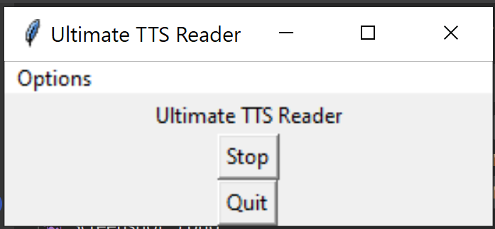

# ultimate-tts-reader
####  awesome app to read text from the clipboard when you press the insert key
```
by oran collins
github.com/wisehackermonkey
oranbusiness@gmail.com
20200415
```
 # Install

> Prebuilt windows binaries are avaiable under releases 

### [ultimate-tts-reader/releases](https://github.com/wisehackermonkey/ultimate-tts-reader/releases)

# how to install (source)

```
git clone https://github.com/wisehackermonkey/ultimate-tts-reader.git
cd ultimate-tts-reader
pip install -r requirements.txt
```

# Devlopment
# how to run 

#### windows only
```
python ./ultimate-tts-reader.py
```
## Useage
```

```
# Dev Log updates

# Update (20200708)
### Improvements 

- increased window size to fit title text
- app now starts minimized 


## How to build windows exe
### install pyinstaller 
```
>pip install pyinstaller 
```
```
cd /path/to/project
```
### Simple build
```
pyinstaller --hidden-import=pyttsx3.drivers  --hidden-import=pyttsx3.drivers.sapi5 --noconsole --onefile ultimate-tts-reader.py
```

# Dev v2 rebuild as tray
```
python -m venv ./python
./python/Scripts/activate
pip install Pillow pystray 
curl -o  piper.zip  https://github.com/rhasspy/piper/releases/download/2023.11.14-2/piper_windows_amd64.zip
python -m zipfile -e piper.zip ./
./piper/piper.exe --help
python ultimate_tts.py
```

# testing piper-tts
```
echo "goodbye world" | ./piper/piper.exe --model voices\en_US-hfc_female-medium.onnx --output_file goodbye.wav
# with cuda
echo "goodbye world" | ./piper/piper.exe --cuda --model voices\en_US-hfc_female-medium.onnx --output_file goodbye.wav
```

## Improvements
- start minimized 
- pause key/button
- fix quit on escape
- voice
 - slow down the voice
 - change voice
- catch KeyboardInterrupt graceful shutdown
- ~~Copy selected text to clipboard or copy selected text and read it~~
- ~~dependence injection
- ~~gui mvp
- ~~change stop use TK to quit
- ~~change stop key to fn + insert

- auto-update
- add zip to releases page github
- ~~increase size of window~~
- ~~start minimized~~~

20240923
- pyinstaller
- move key to ctrl + f2 
- add tray version
- click for play
- monitor ctrl+c
- auto install piper-tss from github
- fix temp folder remove after finish
- fix name conflict add epoc time
- remove print statements
- show error if thing not found


- split the text into chunks and play them 
## Links

tts
https://pyttsx3.readthedocs.io/en/latest/engine.html#examples

keyboard
https://pynput.readthedocs.io/en/latest/keyboard.html

posible solution to pause key
https://github.com/nateshmbhat/pyttsx3/issues/35

Tkinter gui
https://docs.python.org/3/library/tkinter.html

Pyinstaller
https://pyinstaller.readthedocs.io/en/stable/usage.html

<script type="text/javascript" src="https://www.free-counters.org/count/5vlj"></script><br>
 <a href='http://www.counter-zaehler.de'>counter skript</a> <script type='text/javascript' src='https://www.whomania.com/ctr?id=67fe581f5c91eee6e3062f6fdd9aa156c648c349'></script>
